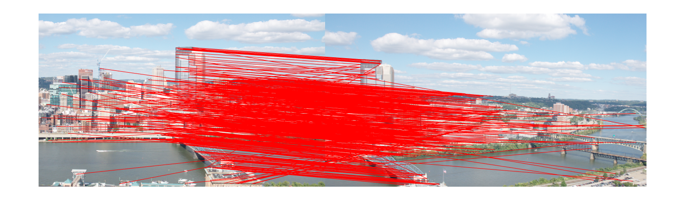

### BRIEF Panoramas Generator - Computer Vision Project

## Steps

By using BRIEF Feature Point Algorithm, I found out the feature point to the images.

    

Applying Edge Supression

    

Feature Point Matching

## Applying to Panoramas

Raw images

   

Feature Point Matching

Panoramas

