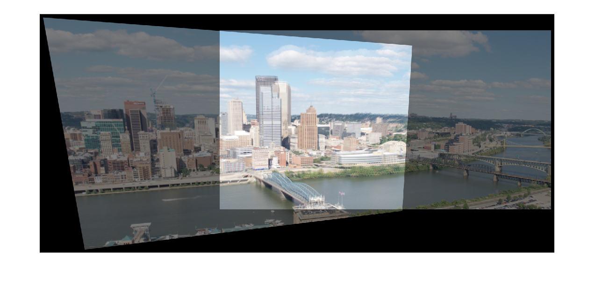
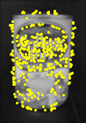
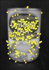
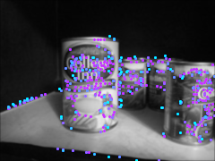

### BRIEF Panoramas Generator - Computer Vision Project

## Steps

By using BRIEF Feature Point Algorithm, I found out the feature point to the images.

  

Applying Edge Supression

  

Feature Point Matching

